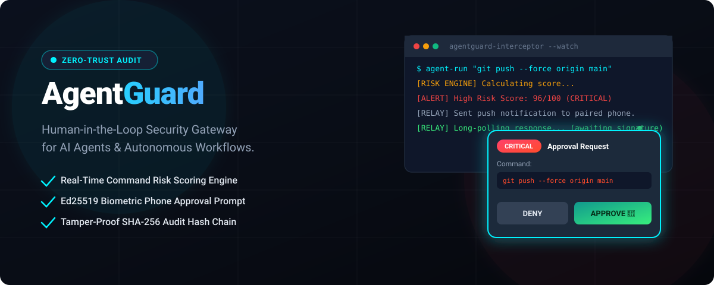
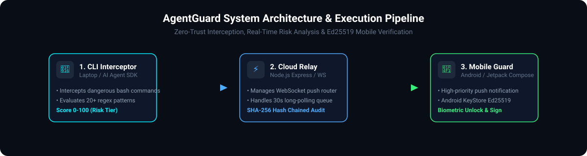

<p align="center">
  
</p>

<p align="center">
  <a href="https://github.com/whysooraj/AGENTGUARD-/releases/latest"></a>
  <a href="#-key-features"></a>
  <a href="#-crypto--verification"></a>
  <a href="#-getting-started"></a>
  <a href="LICENSE"></a>
</p>

---

## 📦 Releases & Downloads

Download official AgentGuard mobile binaries and APK build releases directly from GitHub:

- 🚀 **[GitHub Official Releases Page](https://github.com/whysooraj/AGENTGUARD-/releases)**
- 📲 **[Download Latest APK (`app-debug.apk` - v1.0.0)](https://github.com/whysooraj/AGENTGUARD-/releases/download/v1.0.0/app-debug.apk)** (10.0 MB)

---

## 🛡️ What is AgentGuard?

**AgentGuard** is a zero-trust, human-in-the-loop security gateway designed to protect your infrastructure from accidental or malicious commands issued by autonomous AI coding agents (e.g. Gemini, Claude Code, AutoGPT, custom subagents).

When an AI agent attempts to execute high-risk CLI commands—such as `rm -rf /`, `git push --force`, `terraform destroy`, or database drops—AgentGuard intercepts the execution in real time, evaluates the risk level, and triggers a high-priority push prompt on your mobile device requiring **hardware-backed biometric authentication** (Fingerprint / Face ID) to approve or deny execution.

---

## ⚡ Architecture & Execution Pipeline

<p align="center">
  
</p>

### How AgentGuard Protects Your System

1. **CLI Interceptor & Risk Scoring (`cli/`)**:
   - Intercepts shell invocations (`subprocess.run`, `os.system`, command hooks).
   - Scans 20+ dangerous command patterns using regex analysis.
   - Calculates a risk score (`0-100`) adjusted by context multipliers (`environment`: prod/staging/dev, `scope`, and historical denials).

2. **Cloud Relay Server (`backend/`)**:
   - Receives scored commands and routes approval requests via WebSockets (`wss://`).
   - Handles long-polling 30-second decision timeouts for CLI daemons.
   - Maintains a tamper-evident audit ledger using **SHA-256 hash chaining** (`SHA256(payload + prev_hash)`).

3. **Android Biometric Mobile Guard (`android/`)**:
   - Receives instant push notifications via WebSocket client (`CloudService`).
   - Prompts for Biometric Unlock (Fingerprint / Face ID) to release private key access in Android KeyStore.
   - Signs approval/denial payloads using **Ed25519 detached signatures** over canonical JSON strings.

---

## 🔥 Key Features

- 🎯 **Real-Time Command Interception**: Native Python interceptor wrappers for agent environments.
- 🧮 **Context-Aware Risk Engine**: Categorizes commands into `LOW` (0-30), `MEDIUM` (31-60), `HIGH` (61-90), and `CRITICAL` (91-100).
- 🔑 **Hardware-Backed Biometric Security**: Android KeyStore Ed25519 detached signature verification prevents spoofing or bypass.
- 🔗 **Tamper-Proof SHA-256 Audit Trail**: Hash-chained immutable logging prevents history tampering.
- 🚨 **One-Tap Panic Button**: Instantly halt all active connected agents and subagent execution pools from your phone.

---

## 📊 Risk Score Matrix

| Risk Score | Tier | Action Taken | Example Trigger |
| :--- | :--- | :--- | :--- |
| **0 – 30** | `LOW` | ⚡ Auto-Approve & Log | `npm install`, `ls -la`, `git status` |
| **31 – 60** | `MEDIUM` | 🔔 Mobile Push Notification | `sudo apt update`, `kill -9 <pid>` |
| **61 – 90** | `HIGH` | ⚠️ Mobile Approval Required | `chmod 777`, `history -c` |
| **91 – 100** | `CRITICAL` | 🔒 **Biometric Unlock Required** | `rm -rf /`, `git push --force`, `terraform destroy` |

---

## 🚀 Getting Started

### 1. Start the Cloud Relay Server (`backend/`)

```bash
cd backend
npm install
npm test          # Run automated Jest unit & integration tests
npm start         # Starts HTTP (port 3000) & WebSocket server
```

### 2. Install & Configure the CLI Daemon (`cli/`)

```bash
cd cli
pip install -e .
pytest tests      # Run automated Pytest test suite

# Generate Ed25519 Keypair & start daemon
agentguard-cli --generate-keys
agentguard-cli --relay-url http://localhost:3000 --device-id laptop-primary
```

### 3. Deploy the Android Mobile Guard (`android/`)

1. Open `/android` in **Android Studio**.
2. Build and run on an Android device or emulator running API 26+ (Android 8.0+).
3. Ensure Biometric Unlock (Fingerprint / Screen Lock) is configured on your mobile device.

---

## 🧪 Testing & Verification

AgentGuard includes complete unit and integration test coverage across all layers:

```bash
# Backend Test Suite (Jest)
cd backend && npm test

# CLI Daemon Test Suite (Pytest)
cd cli && ./venv/bin/pytest tests
```

---

## 📜 License

Distributed under the **MIT License**. See `LICENSE` for details.
